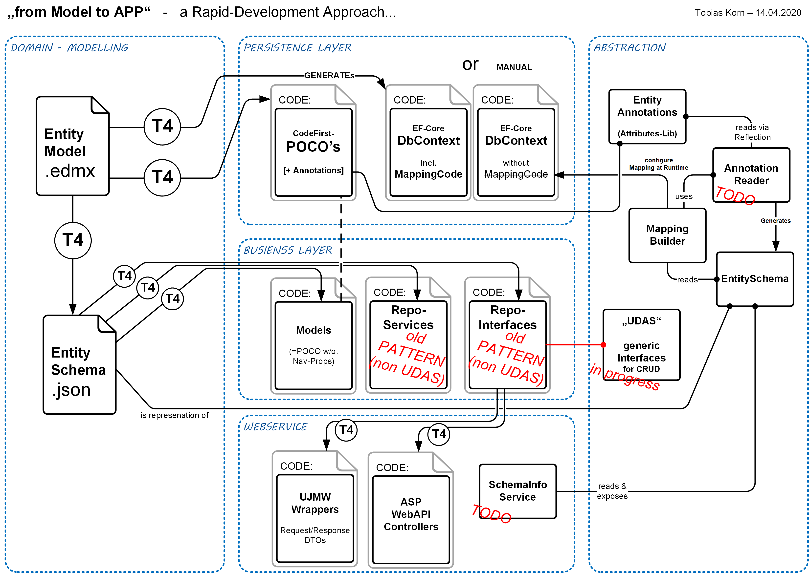

# About

This Project contains T4-Templates to:

* transform EDMX-Models into a JSON based model description 

* generate EF-Code Contexts (including Mapping-Code) from that JSON

* generate POCOs (Entities/Models) from that JSON

* generate Repository-Interfaces from that JSON

  

But everything is implemented within the T4 files, so **there is a new Project called "[kGEN](https://github.com/KornSW/kGEN)"** which has the focus to consolidate all this transformation/generator code (and the code of other generators from KornSW) within **one exe-utility which can be installed and updated via NuGet**...

## The Core-Idea is based on this Concept:

